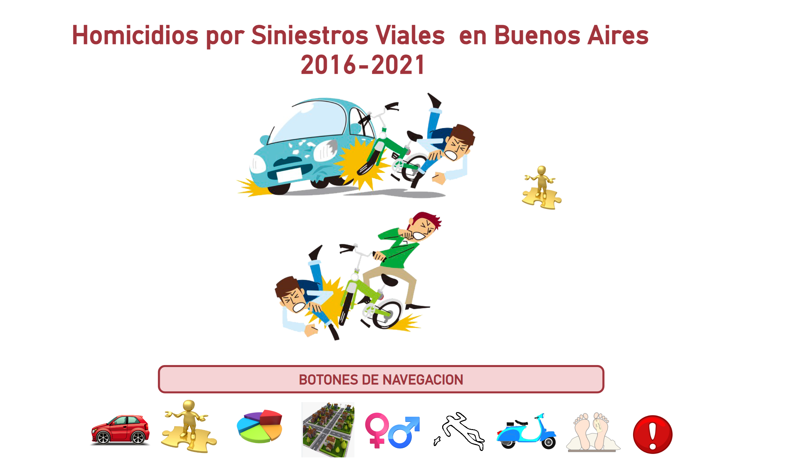

# PROYECTO INDIVIDUAL Nº2 Data Analitycs    
## Siniestros Viales en Buenos Aires  

Los accidentes de tráfico representan una problemática seria que impacta principalmente a conductores, motociclistas y peatones, poniendo en riesgo tanto la seguridad como la movilidad en las vías.   
El propósito fundamental de este proyecto es examinar y comprender detalladamente la información concerniente a los incidentes de tráfico, con el fin primordial de elevar los estándares de seguridad y eficiencia en el flujo vehicular de Buenos Aires, evitando así posibles percances en el futuro. Para llevar a cabo esta tarea, contamos con la colaboración de la Oficina Municipal de Seguridad Vial (OMSV), una institución de investigación afiliada a la Secretaría de Transporte del Gobierno de la Ciudad Autónoma de Buenos Aires, que nos ha proporcionado un conjunto de datos exhaustivo sobre los accidentes fatales ocurridos en la metrópolis entre los años 2016 y 2021.  

## ETL (Extract, Transform, Load)  
Durante esta fase, la ejecución del proyecto se desarrolló de manera fluida y eficiente, enfrentando mínimos obstáculos que pudieran entorpecer el avance del trabajo. Se dedicó un esfuerzo considerable a la construcción de una base sólida y robusta que servirá como punto de partida para el análisis exhaustivo que se llevará a cabo en las siguientes etapas del proyecto.  
  
## Exploración de Datos (EDA, por sus siglas en inglés: Exploratory Data Analysis)
Después de culminar el proceso de Extracción, Transformación y Carga (ETL) y generar el conjunto de datos consolidado, nos adentramos en la fase de Exploración de Datos (EDA). Esta etapa implica sumergirse en los detalles de los lamentables sucesos que deseamos comprender a fondo.  

Durante el análisis estadístico y visualización de los datos, llevamos a cabo las siguientes actividades:  

Utilizamos diversas técnicas gráficas y herramientas de visualización para discernir patrones y relaciones entre las variables, permitiendo una comprensión más profunda de la información.  

Identificamos las variables que presentan una mayor incidencia de siniestros viales, lo que nos proporciona una visión clara de los aspectos más críticos que deben abordarse.  

Investigamos las áreas geográficas, roles desempeñados, rangos de edad y tipos de vehículos asociados con el mayor número de víctimas fatales en estos eventos desafortunados.  

Este análisis exhaustivo nos permite obtener una visión holística de los datos, lo que a su vez nos capacita para tomar decisiones fundamentadas y efectivas orientadas a la prevención y mitigación de futuros incidentes.  

## Herramientas utilizadas
Pandas  
Matplotlib    
Numpy  
Seaborn  
Plotly.graph_objects 

## Dashboard  

